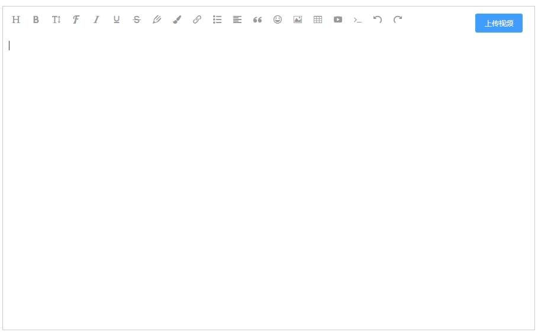

::: tip

本文介绍了一款富文本编辑器在vue中使用及示例。

:::

<!-- more -->

## wangEditor <a href="http://www.wangeditor.com/">项目地址</a>
基于javascript和css开发的 Web富文本编辑器， 轻量、简洁、易用、开源免费

支持常用的富文本编辑器功能，图片上传，网络地址引入，图片复制，视频引入等，具体可自行查看官方文档再做选择。



 tip 附上代码（vue + element-ui）：
 实际关于上传视频的地方需求不同 这里只提供一个解决方法  具体请根据实际使用修改

## 代码

```vue
<template>
	<div class="editor">
		<div class="header">
            <div id="div1" class="toolbar"></div>
            <!-- //这里使用element的upload组件用于上传本地视频
			<el-upload
				class="upload-demo"
				action="你的服务器接收地址"
				:limit="1"
				accept="video/*,.mp4"
				:data="uploadData"
                :disabled='uploadLoading'
                //这里只设置了允许上传一个视频
				v-if='fileList.length == 0 && menus.indexOf("videos")!==-1'
				:show-file-list="false"
				:before-upload="handleBeforeUpload"
				:on-progress="onFileProgress"
				:on-success="handleSuccessUpload"
			>
				<el-button  size="small" type="primary">上传视频</el-button>
			</el-upload>
			<span v-if="uploadLoading">{{ uploadSpeed }}</span>
			<el-progress v-if="uploadLoading" :percentage="progressNum"></el-progress>
             -->
		</div>
		<div id="div2" class="text"></div>
		<div ref="editor" style="text-align:left;"></div>
	</div>
</template>

<script>
import E from 'wangeditor';
var editor;
import emojiArr from './emoji.js';
import { qiniuToken,uploadImg } from '@/api/token';

export default {
	props: {
		content: { type: String, default: '' },
		menus: {
			type: Array,
			default: () => {
				return [
					'head', // 标题
					'bold', // 粗体
					'fontSize', // 字号
					'fontName', // 字体
					'italic', // 斜体
					'underline', // 下划线
					'strikeThrough', // 删除线
					'foreColor', // 文字颜色
					'backColor', // 背景颜色
					'link', // 插入链接
					'list', // 列表
					'justify', // 对齐方式
					'quote', // 引用
					'emoticon', // 表情
					'image', // 插入图片
					'table', // 表格
					'video', // 插入视频
					'code', // 插入代码
					'undo', // 撤销
                    'redo', // 重复
                    //"videos" 默认不开启 需要请传入并配置
				];
			}
		}
	},
	data() {
		return {
			currentValue: '',
			uploadSpeed: '0KB/s',
			uploadData:{
				token:'',key:''
			},
			fileList:[],
			progressNum:0,
			uploadLoading:false,
		};
	},
	methods: {
		createEditor() {
			var that = this;
			var qiniutoken = '';
			editor = new E('#div1', '#div2');
			editor.customConfig = {
				zIndex: 100,
				onchange: function(html) {
					that.currentValue = html;
					that.$emit('on-change', that.currentValue);
				},
				
				menus: that.menus,
				emotions: [
					{
						/*emoji */
						title: '😀',
						type: 'emoji',
						content: emojiArr.Smileys
					},
					{
						//人和幻想
						title: '👶',
						type: 'emoji',
						content: emojiArr.PeopleAndFantasy
					},
					{
						//衣服及配饰
						title: '👚',
						type: 'emoji',
						content: emojiArr.ClothingAndAccessories
					}
				],
				//---------配置上传图片---------
				uploadImgServer:"上传图片的服务器地址",
				customUploadImg :function (files, insert) {
                    //这里需上传
                    insert('上传完成后返回的图片网络地址') 
				}
            };
            //创建编辑器
			editor.create();
			if (this.content) {
				editor.txt.html(`<p>${this.content}</p>`);
			}
		},
		/**
		handleBeforeUpload(file) {
			var fileName = file.name.split('.');
            var suiji = Math.floor(Math.random() * (9999 - 1000)) + 1000;
            //获取七牛token  具体看项目本身上传逻辑
			return qiniuToken({
				type: 2  //1图片 2视频 
			}).then(data => {
				this.uploadData.token = data.data;
				this.uploadData.key = 'TB_' + this.$md5(fileName[0] + suiji) + '.' + fileName.pop();
				this.uploadLoading = true;
			});
		},
		onFileProgress(event, file, fileList) {
			this.fileList = fileList
			var self = this
			var uploadTime = (event.timeStamp / 1000).toFixed(2);
			var uploadSize = (event.loaded / 1024).toFixed(2);
			var speed = (uploadSize / uploadTime).toFixed(2);
			var progress = Number.parseInt((event.loaded / event.total).toFixed(2) * 100);
			self.progressNum = progress;
			if (speed > 1000) {
				speed = (speed / 1000).toFixed(2) + 'MB/s';
			} else {
				speed = speed + 'KB/s';
			}
			this.uploadSpeed = speed;
		},
		handleSuccessUpload(response, file, fileList) {
            // 上传成功后执行的操作
            var videoLink = "视频地址"
            var video = '<video src='+videoLink + 'controls="controls" width="100%"></video>'
            //这里根据需求设置视频样式
            editor.txt.append(`<p><video src=${videoLink} controls="controls" style='width:100%;height:400px'></video><br></p>`);
            //变更后改变父组件
            this.$emit('on-change', editor.txt.html());
			
		},
        */
		setCurrentValue(value) {
			if (value === this.currentValue) return;
			editor.txt.html(`<p>${value}</p>`);
		}
	},
	mounted() {
		this.createEditor();
	},
	watch: {
		content(val) {
			this.setCurrentValue(val);
		}
	}
};
</script>
<style>
.header{
	position: relative;
}
.upload-demo{
	position: absolute;
	right: 20px;
	top: 10px;
}
.w-e-text-container {
	height: 300px !important;
}
.w-e-toolbar {
	background: transparent !important;
	padding: 10px;
}
.editor {
	border: 1px #ccc solid;
}

#div2 {
	min-height: 500px;
}

</style>

```